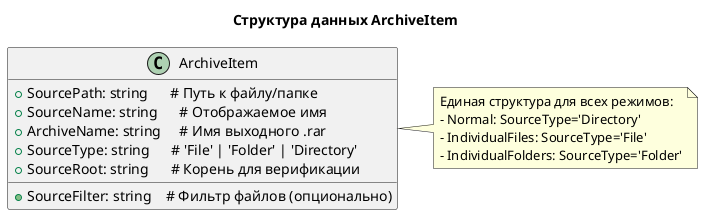
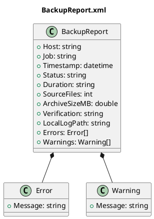
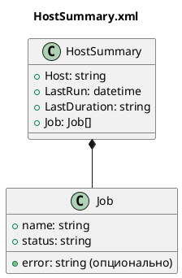

# Диаграммы процесса Backup-ps2-v4.ps1

## Mermaid Flowchart

Современный формат для веб-просмотра (GitHub, GitLab, Mermaid Live Editor):

```mermaid
flowchart TD
    A[Start] --> B[Run Script]
    B --> C{XML File Found?}
    C -->|No| D[Critical Error: XML Not Found<br/>Exit 1]
    C -->|Yes| E[Verify XML Hash]
    E -->|Hash Mismatch| F[XML Validation Failed<br/>Exit 1]
    E -->|Hash Matches| G[XML Verified Successfully]
    G --> H[Load Configuration from XML]
    H --> I{Archiver Type = RAR?}
    I -->|No| J[Critical Error: Only RAR Supported<br/>Exit 1]
    I -->|Yes| K[Build Config Hash Tables]
    K --> L[Extract Variables:<br/>PCName, SmtpServer, AdminMail]
    L --> M{Test Mode?}
    M -->|Yes| N[Test Mode Checks:<br/>- Check Archiver<br/>- Check Sources<br/>- Check Write Permissions<br/>- Check SMTP<br/>- Check Recipients<br/>- Send Test Email]
    N --> Z[Exit]
    M -->|No| O[Initialize Logging<br/>Create Log File]
    O --> P[Log Section: SCRIPT START]
    P --> Q[Validate Configuration]
    Q -->|Invalid| R[Output Errors<br/>Exit 1]
    Q -->|Valid| S[Log Windows Event: Start]
    S --> T[For Each Job in Config]
    T --> U[Log Section: JOB: job_name]
    U --> V[Check/Create Directories:<br/>Source, LocalDest, RemoteDest]
    V --> W[Get File Info Details<br/>Analyze Source]
    W --> X{Source Check Masks?}
    X -->|Yes| Y[Filter File List by Masks]
    X -->|No| AA[Skip Filtering]
    Y --> AB{List Source Flag?}
    AA --> AB
    AB -->|Yes| AC[Get File List<br/>Create TXT/CSV List]
    AB -->|No| AD[Skip File Listing]
    AC --> AE{Archive Mode?}
    AD --> AE
    AE -->|Individual Files| AF[Individual File Archivation<br/>Prepare-ArchiveItems + Invoke-ArchivePipeline]
    AE -->|Individual Folders| AG[Individual Folder Archivation<br/>Prepare-ArchiveItems + Invoke-ArchivePipeline]
    AE -->|Normal| AH[Normal Archivation<br/>Invoke-ArchivePipeline]
    AF --> AI[Invoke-Verification<br/>Compare Files Source Archive]
    AG --> AI
    AH --> AI
    AI --> AJ{Verification Passed?}
    AJ -->|No| AK[ERROR: Integrity Violation]
    AJ -->|Yes| AL[Verification Passed]
    AK --> AM{Remote Dest Accessible?}
    AL --> AM
    AM -->|Yes| AN[Copy Backup File to Remote Storage]
    AN --> AO{Remove Remote Dest Flag?}
    AM -->|No| AP[WARNING: Saved Locally Only]
    AO -->|Yes| AQ[Remove-OldFiles<br/>Rotate Remote Storage]
    AO -->|No| AR[Skip Remote Rotation]
    AP --> AS[Remove-OldFiles<br/>Rotate Local Storage]
    AQ --> AS
    AR --> AS
    AS --> AT{Remove Source Flag?}
    AT -->|Yes| AU{Individual Mode?}
    AT -->|No| AV[Remove-OldFiles<br/>Rotate Source]
    AU -->|Yes| AW[Verify Before Deletion<br/>Compare Files Source Archive]
    AU -->|No| AV
    AW --> AX{All Verified?}
    AX -->|Yes| AY[Delete Verified Files/Folders]
    AX -->|No| AZ[WARNING: Deletion Cancelled]
    AY --> BA[Write XML Report for Job]
    AZ --> BA
    AV --> BA
    BA --> BB{More Jobs?}
    BB -->|Yes| T
    BB -->|No| BC[Remove-OldFiles<br/>Cleanup Old Logs]
    BC --> BD[Get Disk Space Report]
    BD --> BE[Log Section: FINAL RESULTS]
    BE --> BF[Write Summary XML Report]
    BF --> BG[Get Log Results<br/>Format Email Text]
    BG --> BH{Errors Exist?}
    BH -->|Yes| BI[Subject: ERRORS DETECTED<br/>Recipients: AdminIS, AdminOS<br/>EventLog: Error]
    BH -->|No| BJ[Subject: SUCCESS<br/>Recipients: AdminIS, AdminMail<br/>EventLog: Success]
    BI --> BK[Send Email Report]
    BJ --> BK
    BK --> BL[EventLog: End]
    BL --> BM{Error Count > 0?}
    BM -->|Yes| BN[Exit 1]
    BM -->|No| BO[Exit 0]
```

---

## PlantUML Activity Diagram

Традиционный формат для корпоративной документации:

```plantuml
@startuml
skinparam backgroundColor #F5F5F5
skinparam activityBackgroundColor #FFFFFF
skinparam activityBorderColor #333333
skinparam activityBorderThickness 2
skinparam defaultFontSize 14
skinparam defaultFontName Arial

start

:Запуск скрипта;
note right: powershell.exe -executionpolicy RemoteSigned -file .\Backup-ps2-v4.ps1

partition "ЭТАП 0: Проверка XML" {
    :Поиск Backup-Config-All.xml;
    if (XML найден?) then (нет)
        :КРИТИЧЕСКАЯ ОШИБКА;\nexit 1;
        stop
    else (да)
        :Test-FileIntegrity()\nSHA256 хеш XML;
        if (Хеш совпадает?) then (нет)
            :ПРОВЕРКА ПРОВАЛЕНА;\nexit 1;
            stop
        else (да)
            :XML проверен успешно;
        endif
    endif
}

partition "Загрузка конфигурации" {
    :Чтение XML (Get-Content);\nПарсинг в [xml]$xmlDoc;
    :Проверка ArchiverType == "RAR";
    if (Тип = RAR?) then (нет)
        :КРИТИЧЕСКАЯ ОШИБКА;\nexit 1;
        stop
    else (да)
        :Формирование $BackupConfig\nи $config хеш-таблиц;
        :Извлечение переменных:\nPCName, SmtpServer, AdminMail и т.д.;
    endif
}

partition "ЭТАП 1: Проверка архиватора" {
    :Получение пути к rar.exe из конфига;
    :Test-FileIntegrity()\nSHA256 хеш rar.exe;
    if (Хеш совпадает?) then (нет)
        :ПРОВЕРКА ПРОВАЛЕНА;\nexit 1;
        stop
    else (да)
        :Архиватор RAR проверен;
    endif
}

partition "ЭТАП 2: Основной запуск" {
    if (Режим -TestMode?) then (да)
        :ТЕСТОВЫЙ РЕЖИМ;
        :Проверка архиватора;\nПроверка источников;\nПроверка прав записи;\nПроверка SMTP;\nПроверка получателей;
        :Отправка тестового письма;\nexit;
        stop
    else (нет)
        :Initialize-Logging()\nСоздание лог-файла;
        :Write-LogSection "ЗАПУСК СКРИПТА";
        :Test-Configuration()\nВалидация конфигурации;
        if (Конфиг валиден?) then (нет)
            :Вывод ошибок;\nexit 1;
            stop
        else (да)
            :Write-WinEventAppLog "Start";
        endif
    endif
}

partition "Цикл обработки заданий" {
    :foreach ($jobName in $config['Jobs'].Keys);
    repeat
        :Write-LogSection "ЗАДАНИЕ: $jobName";
        :Проверка/создание директорий\n(Source, LocalDest, RemoteDest);
        :Get-FileInfoDetails()\nАнализ источника;

        if (Есть SourceCheckMasks?) then (да)
            :Get-FilterFileList()\nПроверка файлов по маскам;
        endif

        if (ListSourceFlag?) then (да)
            :Get-FileList()\nФормирование списка файлов (txt/csv);
        endif

        if (ArchiveIndividualFiles?) then (да)
            :ИНДИВИДУАЛЬНАЯ АРХИВАЦИЯ ФАЙЛОВ;
        elseif (ArchiveIndividualFolders?) then (да)
            :ИНДИВИДУАЛЬНАЯ АРХИВАЦИЯ ПАПОК;
        else (нет)
            :ОБЫЧНАЯ АРХИВАЦИЯ;
        endif

        :Invoke-ArchivePipeline()\nАрхивация через RAR;

        :Invoke-Verification()\nПроверка целостности архива;

        if (Верификация пройдена?) then (нет)
            :ОШИБКА: Нарушение целостности;
        else (да)
            :ВЕРИФИКАЦИЯ ПРОЙДЕНА;
        endif

        if (RemoteDest доступен?) then (да)
            :Copy-BackupFile()\nКопирование в сетевое хранилище;
            if (RemoveRemoteDestFlag?) then (да)
                :Remove-OldFiles()\nРотация удалённого хранилища;
            endif
        else (нет)
            :WARNING: Сохранено только локально;
        endif

        :Remove-OldFiles()\nРотация локального хранилища;

        if (RemoveSourceFlag?) then (да)
            if (Индивидуальный режим) then (да)
                :ВЕРИФИКАЦИЯ ПЕРЕД УДАЛЕНИЕМ;\nCompare-FilesSourceArchive();
                if (Все прошли?) then (да)
                    :Удаление проверенных файлов/папок;
                else (нет)
                    :WARNING: Удаление ОТМЕНЕНО;
                endif
            else (нет)
                :Remove-OldFiles()\nРотация источника;
            endif
        endif

        :Сохранение XML-отчёта по заданию;
        :Write-Log "Задание завершено";
    repeat while (Есть ещё задания?) is (да)
    -> нет;
}

partition "Финальные результаты" {
    :Remove-OldFiles()\nОчистка старых логов;
    :Get-DiskSpaceReport()\nДиагностика дисков;
    :Write-LogSection "ФИНАЛЬНЫЕ РЕЗУЛЬТАТЫ";
    :Write-HostSummary()\nСводный XML-отчёт;
    :Get-LogResults()\nФормирование текста письма;

    if (Есть ошибки?) then (да)
        :Subject = "...ОБНАРУЖЕНЫ ОШИБКИ";\nПолучатели: AdminIS, AdminOS;
        :Write-WinEventAppLog "Error";
    else (нет)
        :Subject = "...УСПЕХ";\nПолучатели: AdminIS, AdminMail;
        :Write-WinEventAppLog "Success";
    endif

    :Send-Email()\nОтправка отчёта по почте;
    :Write-WinEventAppLog "End";

    if (errorCount > 0) then (да)
        :exit 1;
    else (нет)
        :exit 0;
    endif
}

stop
@enduml
```

---

## Unified Pipeline: Структура данных ArchiveItem

---

## Формат сетевого отчёта (XML)

---

## Формат сводного отчёта (summary.xml)

---

## Сравнение форматов

| Формат       | Преимущества                    | Недостатки         | Применение                   |
| ------------ | ------------------------------- | ------------------ | ---------------------------- |
| **Mermaid**  | Веб-совместимость, Git-friendly | Ограниченные стили | GitHub, GitLab, документация |
| **PlantUML** | Богатые стили, активности       | Требует рендеринг  | Корпоративная документация   |

---

## Просмотр диаграмм

### Mermaid
- **Онлайн:** https://mermaid.live/
- **VS Code:** Расширение "Markdown Preview Mermaid Support"
- **GitHub:** Автоматический рендеринг в markdown

### PlantUML
- **Онлайн:** https://www.plantuml.com/plantuml/
- **VS Code:** Расширение "PlantUML"
- **IntelliJ:** Встроенная поддержка